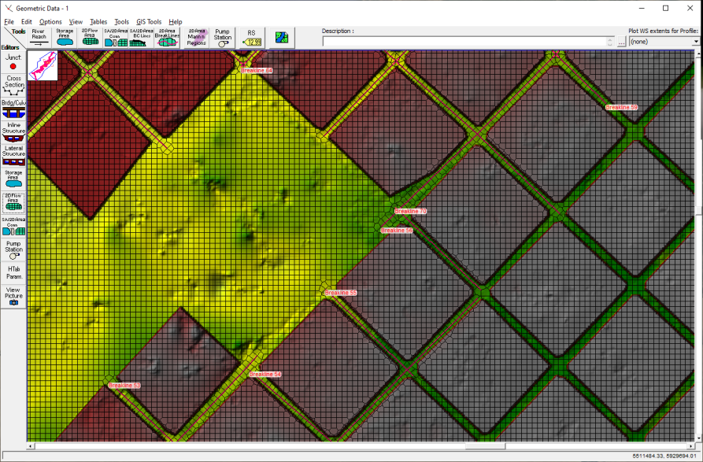

Conservation laws and Domain meshing for numerical simulations
==============================================================

Mass and momentum conservation
-------------------------------
Any conservation law for fluid motion can be expressed in conservative formulation as a partial differential equation (PDE), that in case of a depth-averaged model (shallow water equations or SWE) in a 2D or X-Y plane is written as:

.. math::

   \frac{\delta \bar U} {\delta t} + \frac{\delta \bar F} {\delta x} + \frac{\delta \bar G} {\delta y}=\bar H 
   
Where U is the vector of conservative variables, F and G are flows in X and Y directions respectively, and H is a source term:

.. math::
   
   \bar U &=(h, hU_x, hU_y)^T

   \bar F &=(hU_x, hU^2_x+\frac{1}{2}gh^2, hU_xU_y)^T
   
   \bar G &=(hU_y, hU_yU_x, hU^2_y+\frac{1}{2}gh^2)^T
   
   \bar H &=(0, gh(So_x-Sf_x), gh(So_y-Sf_y))^T

.. list-table:: 
   :widths: 10 20 10 20
   :header-rows: 1

   * - Symbol
     - Variable and dimension
     - Symbol
     - Variable and dimension
     
   * - h
     - water depth (m)
     -
     -
   * - Ux
     - X-velocity (m/s)
     - Uy
     - Y-velocity (m/s)
   * - :math: 'So_x={\delta Z_b}over{\delta x}'
     - X-Slope ()
     - Soy
     - Y-Slope ()
   * - Sfx
     - X-friction slope (m^3/s^2)
     - Sfy
     - Y-friction slope (m^3/s^2)
   * - g
     - gravity constant (m/s^2)  
     -
     -
   

The differential solvers are evaluated across neighbouring cells of a domain or mesh, that historically have been evolving from quadrilateral to triangular shapes.
As first example, the raster based approach used by Lisfloood-FP is presented:

Type of mesh
------------

.. image:: TriangularMeshes.png
  :width: 400
  :alt: Typical triangular based meshes

Triangular based meshes for 2D domains, to discretize the mass and momentum differential equations. As example, the non-structured triangle based approach used by RiverFlow2D, a Delaunay tessellation:

Practical approach: hybrids
---------------------------
The river main channel interaction with the floodplain by overtopping embankments or levees can be modelled using a combination of cells (quadrilateral or triangular) which will require higher density of cells in the transitions or when the speed pattern is expected to be more complex or less uniform in space. The whole domain can be seen as a 1D conduit plus a 2D plain: 

Or as a complete 2D domain, which is easier to config and more stable, but demands more memory and CPU time.
For instance RSH-2D (US Bureau of Reclamation, 2008) combines quadrilateral cells along the main channel and levees but mixed coarser cells at the plains.

.. image:: SRH-Hybrid.png
  :width: 400
  :alt: SRH
  
Or the widespread non-structured triangular mesh for the whole domain, also known as flexible mesh, note the finest resolution around levees:

In the presence of building blocks, with no porosity, the grids are adapted to the free flood ways, as seen in this HEC-RAS example which uses breaklines as axis for the streets:

The Time Step issue
-------------------
For an orthogonal or cartesian meshed domain  :math:`\Omega` , the Courant-Friedrichs-Levy criteria defines a CFL coefficient that linearly weights the time-step :

.. math::

  \Delta t_{x, y} &= CFL \frac{\Delta {x, y}} {\left| U_{x, y} \right|  + \sqrt{gh}}
 \\
 \\
  \Delta t &= min(\Delta t_x, \Delta t_y)_{\Omega}

Note that if :math:`(\Delta {x, y}\ll, U_{x, y}\gg, h\gg )\Longrightarrow \Delta t \rightarrow 0`

The time-step governs the mass conservation at every control-volume or cell, for instance in 2D(X, Y):

.. math::

  \frac{\delta h} {\delta t} + \frac{\delta (hU_x)} {\delta x}+ \frac{\delta (hU_y)} {\delta y}=0 

Whereas we go deeper with the simpler 1D(X) formulation:

.. math::

  \frac{\delta A} {\delta t} + \frac{\delta Q} {\delta x}=0 

Which can be discretized (super-index 'n' stands for evolution in time and sub-index 'i' for location in 1D-grid) in an explicit way, like the Euler scheme :

.. math::

  \frac{ A^{n+1}_i - A^{n}_i} {\Delta t} + \frac{Q^{n}_{i+1/2}-Q^{n}_{i-1/2}} {\Delta x}=0 

Called explicit because the value at 'n+1' can be formulated joining only known terms at 'n' on the right hand side:

.. math::

  A^{n+1}_i =  A^{n}_i+ \frac{\Delta t}{\Delta x} \left( Q^{n}_{i-1/2}-Q^{n}_{i+1/2} \right) 

Which allows for stability if  :math:`CFL \lt 1`

Whereas an implicit discretization scheme, like the box-scheme:

.. math::

  \frac{ \left( \Psi A^{n+1}_{i+1} + (1-\Psi) A^{n+1}_i \right)  - \left( \Psi A^{n}_{i+1} + (1-\Psi) A^{n}_i \right)} {\Delta t} +\\
  \frac{\Theta \left(Q^{n+1}_{i+1}-Q^{n+1}_{i}\right)  + (1-\Theta)\left( Q^{n}_{i+1}-Q^{n}_{i}\right)} {\Delta x}=0 
  
With  spatial weight :math:`0 \le \Psi \le 1`, and implicit parameter :math:`0 \le \Theta \le 1` allows for stability even with :math:`CFL \gt 1`

The price for an implicit scheme, as briefly seen, is that the solving algorithm and coding are more complex but the execution can be faster, depending also on the domain mesh division and its hardware distribution among processing units (CPU, GPU or TPU).
Particularly, the popular HEC-RAS code uses an implicit scheme formulation.

Note we did not consider the conservation of momentum, for the sake of simplicity in the formulation.
To know more visit[]

Simulation mass balance
-----------------------

One overall value to check at the end of every simulation is the mass conservation applied to the entire domain for accounting the difference of volume, and all the inflows and outflows across the boundaries.

.. math::

  V^{T} -V^{0} =  \sum_k{Q^k_{in} \Delta t_k} - \sum_k{Q^k_{out} \Delta t_k}
 
Where

.. math::

  V^{n}=\sum_{\Omega}h^n_{ij}\delta x_i \delta y_j 
