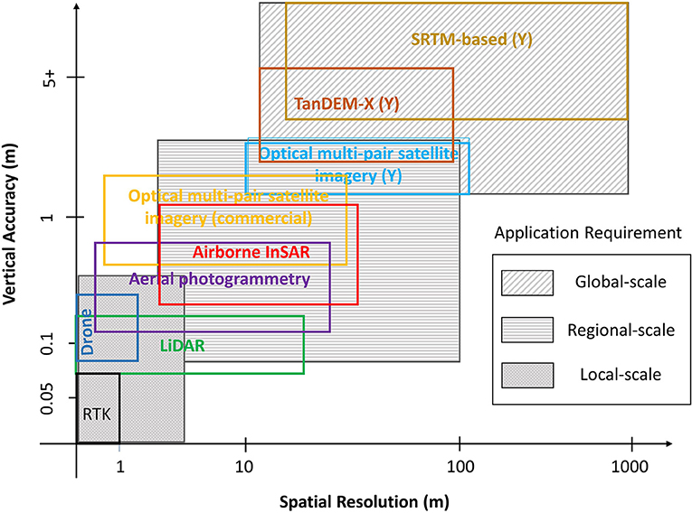
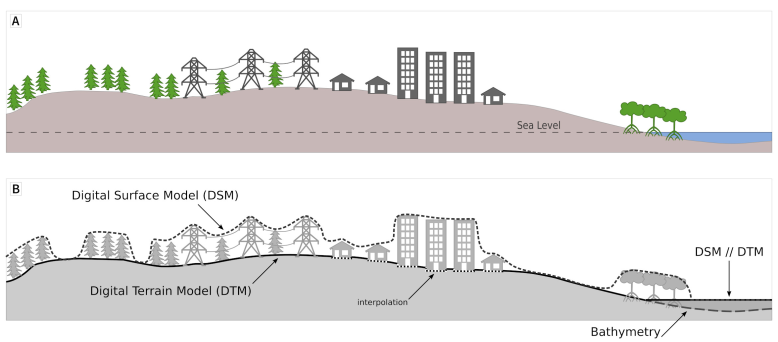

Digital Elevation Models
========================

Common sources and vertical accuracy
------------------------------------

DEMs: spatial resolution and vertical accuracy for different RS techniques and scales of application. From `Schumann & Bates, 2018`_

.. _Schumann & Bates, 2018: https://doi.org/10.3389/feart.2018.00225

DSM filtering to obtain DTM
---------------------------

  
 
Digital Surface Model versus Terrain Model in Terminology and Definitions for Digital Elevation Models, from _`Guth et al, 2021`_ 

.. _Guth et al, 2021: https://doi.org/10.3390/rs13183581 

Training with affordable drones
-------------------------------

In this section we practice with High-Quality drone imagery and the Open-Drone-Map software (`ODM`_).

.. _ODM: https://opendronemap.org/'

One detailed study case is the Chosica district, at Lima, Perú.

