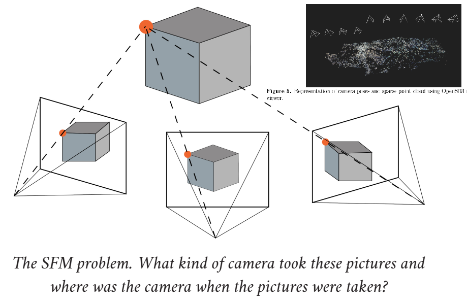
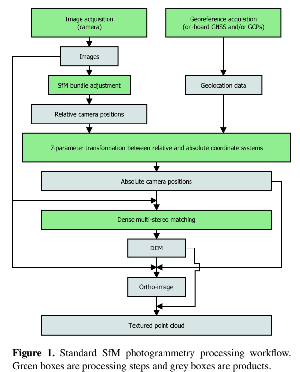
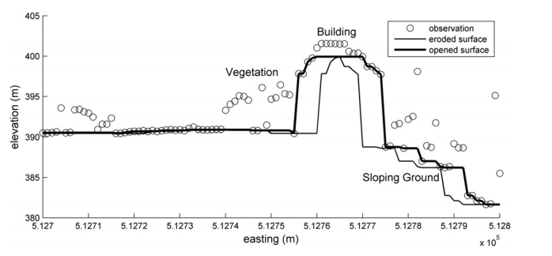

Digital Elevation Models
========================

Common sources and vertical accuracy
------------------------------------

.. image:: VAccuracy-Scales_Schumann-Bates_2018.jpg
  :width: 400
  :alt: Vertical accuracy, scales and common techs.

DEMs: spatial resolution and vertical accuracy for different RS techniques and scales of application. From `Schumann & Bates, 2018`_

.. _Schumann & Bates, 2018: https://doi.org/10.3389/feart.2018.00225

DSM filtering to obtain DTM
---------------------------

.. image:: DSM_DTM_Guth_et_al_2021.png
  :width: 600
  :alt: DSM & DTM.
  
 
Digital Surface Model versus Terrain Model in "Terminology and Definitions for Digital Elevation Models", `Guth et al, 2021`_.

.. _Guth et al, 2021: https://doi.org/10.3390/rs13183581 

To understand how to transform a DSM from a Remote-Sensing device, as simple and affordable as a drone camera, in optical range (no LiDAR nor laser detection),
we describe briefly the principles to generate a cloud of points from geo-referenced pictures (SfM: structure from motion), the 3D building of the surface model (dense multi-stereo matching) and the filtering with a SMRF (Simple Morphological Filter) to remove basically vegetation and blocks to work with bare earth. 

Structure from motion principles and dense reconstruction
^^^^^^^^^^^^^^^^^^^^^^^^^^^^^^^^^^^^^^^^^^^^^^^^^^^^^^^^^

  

  
The workflow comes from the selected reference of `Girod et al, 2017`_.

.. _Girod et al, 2017: https://tc.copernicus.org/articles/11/827/2017/ 

Filtering with SMRF windows
^^^^^^^^^^^^^^^^^^^^^^^^^^^

  
How a surface or a cloud of points is eroded with a SMRF filter using different slopes, or window height and length  parameters, by `Pingel et al, 2013`_. 
And how the parameters are tunned with smrf `ODM-flags`_.

.. _Pingel et al, 2013: http://dx.doi.org/10.1016/j.isprsjprs.2012.12.002

.. _ODM-flags: https://docs.opendronemap.org/arguments/ 

Training with affordable drones
-------------------------------

In this section we practice with High-Quality drone imagery and the Open-Drone-Map software (`ODM`_), to obtain DSMs and DTMs from simple flights to 
set the essential ground data for reliable simulations, at scales of a few hectares.

.. _ODM: https://opendronemap.org/

The basic documentation for processing a package of photographs from a drone flight can be reached at `docs-opendronemap`_.

.. _docs-opendronemap: https://docs.opendronemap.org/

A repository with significant packages to start training, will be available soon. 
