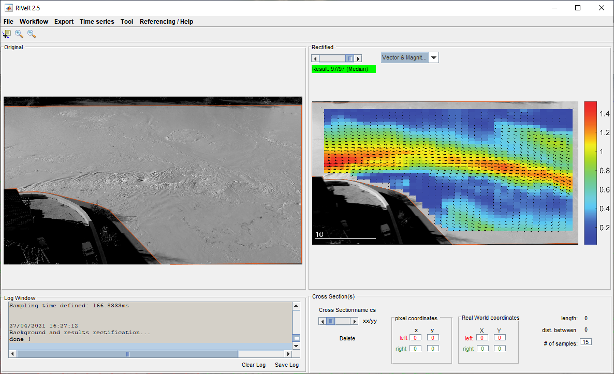

Drones + LSPIV: local flow-speed measurements 
==============================================

In this section we practice with High-Quality drone imagery and the RIVeR software (`RIVeR`_), based in `PIV-lab`_.

.. _RIVeR: https://riverdischarge.blogspot.com/

.. _PIV-lab: https://pivlab.blogspot.com/

LSPIV processing of drone captured videos, allows to detect and measure river flow patterns, like this recirculation as result of a expansion, 
downstream a dyke.

