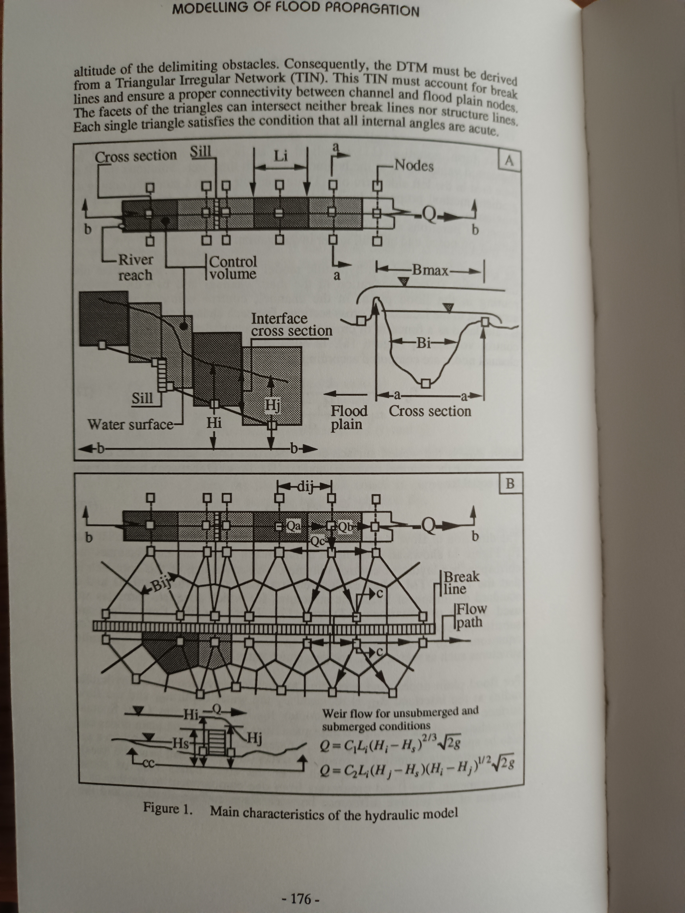

Historical reviews
==================

As stated by `Stoker`_ , in "Water Waves: The Mathematical Theory with Applications", since 1957 it is clear and feasible to make predictions of floods in rivers knowing the state of the river at some initial instant,
and the observed-estimated or forecasted, flow into the river from its tributaries and the local run-off, through the basic differential equations we have roughly presented, and their associated numerical solutions solved by computers.

After more than 60 years of Stoker practices, the digital era with open access RS data and affordable computing processors, has popularized the Flood-Mapping science, a state of the art methodology can be found in "Flood Inundation Prediction" by `Bates, 2022`_, being the main challenges to face: 

* Rationalize and properly select among the considerable bulk of observational data, including the imagery to validate predictions.

* Match the numerical engine which describes best the physical process, to the available terrain model (resolution and accuracy) and temporal scales, assuming the computational cost. In general relaxing the grid resolution to coarse pixels, allows to validate more parameters and scenarios, that for large scale hazard mapping related to Climate Change is very relevant, but non-appropriate for local hydraulic modelling.

.. _Stoker: https://doi.org/10.1002/9781118033159

.. _Bates, 2022: https://doi.org/10.1146/annurev-fluid-030121-113138

Scanned images
--------------

The concept of "breakline" for the river axis and flow distribution across plain cells, 1994, by Giammarco and Todini.

