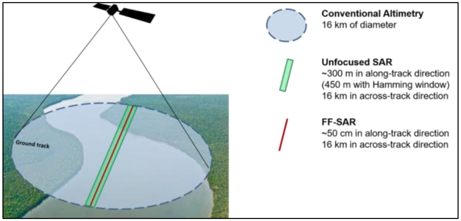
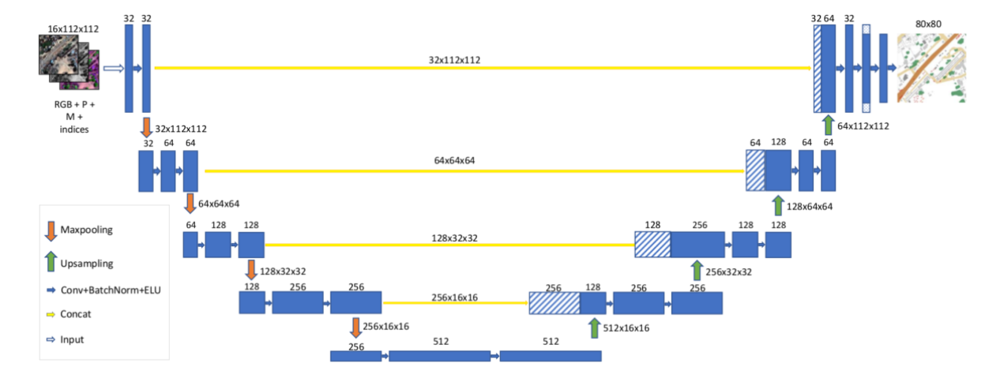

Large Scale Modelling assisted by Satellite imagery and Artificial Intelligence
===============================================================================

While monitoring large areas or tiles of several hundred Kilometers, with pixel size over 25 meters, 
it is convenient to reduce the complexity of the shallow water equations (SWE) in order to allow larger 
time-steps for numerical simulations at the expense of loosing accuracy for the speed field pattern or wave propagation time.
The objective for Large Scale Modelling (LSM) is to maintain critical information like the maximum flood extent and its duration, but none about highly transient states nor dynamics related to fine grid resolutions: trans-critical flows, overtopping, sediment transport and bed river evolution, pollutant dispersion, etc.
 
Difussion-Wave or Zero-Inertia approximation
---------------------------------------------

The momentum conservation at every control-volume or cell for the full (or complete) SWE equations, 1D(X) case, states:

.. math::

  \frac{\delta Q} {\delta t} + \frac{\delta \left( Q^2/A \right)} {\delta x} = gA \frac{\delta \left( Z_b+h \right)} {\delta x}-S_f 

.. list-table:: 
   :widths: 10 20 10 20
   :header-rows: 1

   * - Symbol
     - Variable and dimension
     - Symbol
     - Variable and dimension
     
   * - Q
     - discharge (m^3/s), Q=Av
     - A
     - area      (m^2)
   * - Zb
     - bed level (m)
     - h
     - water depth (m)
   * - Sf
     - friction slope (m^3/s^2)
     - g
     - gravity constant (m/s^2)

Can be adapted (or adopted) for LSM considering the inertial (or acceleration) terms vanish:

.. math::

  \frac{\delta Q} {\delta t} \rightarrow 0 \\
  \frac{\delta \left( Q^2/A \right)} {\delta x} \rightarrow 0 \\
  
Or equivalently:

.. math::

  S_f = gA \frac{\delta \left( Z_b+h \right)} {\delta x} \equiv gA \nabla (Z_b+h)\\

That links friction slope with stage gradient. Using empirical Manning´s formulation with 'n' as roughness coefficient,  1D(X) or 2D(X, Y):

.. math::

  S_{f}=n^2 \frac{Q \left| Q \right| }{A^2 R^{4/3}}, \;
  S_{f x, y}=n^2 \frac{U_{x, y} \sqrt{U^2_x+U^2_y} }{h^{4/3}} 

allows to define the intercell discharge 'q'. For instance, the 2D code Lisflood-FP uses

.. math::

 q^{n+1}_{i+1/2} =  \frac{(h^n_f)^{5/3}}{n} \nabla(Z_b+h^n)^{1/2}_{i+1/2}  

With the flow-depth  as

.. math::

 h^n_f=max \left( (Z_b+h^n)_i, (Z_b+h^n)_{i+1}\right)-max \left((Z_b)_i, (Z_b)_{i+1} \right)
 
And an interesting implicit version 

.. math::

 q^{n+1}_{i+1/2} =  \frac{q^n_{i+1/2} -g h^n_f \Delta t \nabla(Z_b+h^n)_{i+1/2}}{1+g \Delta t \frac{n^2  \left|q^n_{i+1/2}\right|}{(h^n_f)^{7/3}}}  

See for more details `Neal et al, 2012`_ .

.. _Neal et al, 2012: https://doi.org/10.1029/2012WR012514

Satellite Optical and IR bands to detect water bodies: MNDWI index
-------------------------------------------------------------------

The combination of bands that defines the Modified Normalized Difference Water Index (MNDWI) is visible green (537-582 nm) and short-wave infrared (1539-1681 nm), that in case of the Sentinel-2 MSI are B3 and B11 respectively:

.. math::

 MNDWI=\frac{B_3-B_{11}}{B_3+B_{11}}
 
 
See for more details `Cordeiro et al, 2021`_ .
 
.. _Cordeiro et al, 2021: https://doi.org/10.1016/j.rse.2020.112209 

It is a relatively easy way of processing and detecting water surfaces over a certain "MNDWI" threshold value, coping with bimodal pixel distributions and the Otsu optimal threshold, in fact the problem is to detect accurately the dry-wet boundaries, and there the computational vision techniques for noise filtering and edge detectors play a major role. See the practical case with Google-Earth-Engine for `Paso de las Piedras`_ reservoir, Bahía Blanca, Argentina.

.. _Paso de las Piedras: https://www.researchgate.net/publication/357174237_Prototipo_Google-Earth-Engine_para_el_modelado_hidrologico_del_embalse_Paso_de_Las_Piedras_Argentina

Altimetry fundamentals
----------------------
Apart from a flood or water body extent, satellite signals can measure water surface elevations too, in order to understand the signal processing we review the main concepts to determine the water surface elevation as:

.. math::

 h_{WSE} &= H_{Sat}-\left( R_0 + R_{Dry-tropo} + R_{Wet-tropo} + R_{Iono}  \\
         + R_{Solid-Earth-Tide} + R_{Pole-Tide} + R_{Geoid}\right)
 
Considering corrections due to instruments, propagation and geophysical factors. The figure displays the footprint for an altimetry mission with Synthetic Aperture RADAR (SAR) signal and its typical resolution along-track axis.
 

Image processing: noise filtering
---------------------------------
Multi-Spectral and Panchromatic imagery are subject to the presence of cloud cover, whereas SAR microwaves are not perturbed. For the former group
access to pre-event images or filtering techniques are needed. The presence of vegetation over water bodies is a common and frequent source of noise for any exploitation of remote sensing imagery. 
SAR imagery researchers and practitioners continue improving algorithms to identify water bodies under vegetation or between buildings, considering effects like double bounce and shadows for the backscatter, that depend on the wave-length, polarisation and incidence angle, and of course the surface roughness and dielectric properties, but those SAR processing  techniques are out of the scope of this basic manual.

Image processing: edge detectors and buffers
--------------------------------------------
To locate the wet-dry boundaries a 2D convolution operator is set to identify that particular pattern across the domain, this is an image processing technique commonly used, that for every pixel of the domain weights the surrounding pixels according to a defined Kernel.
For instance to detect a North dry-wet edge, a 3x3 kernel can be set to {[1, 1, 1], [-1, -1, -1 ], [0, 0, 0]} and subsequently applied to a MNDWI or back-scatter water surface layer,  to detect negative values below a threshold which are candidates to represent a North dry-wet bound. 

The following image summarizes the action of a Kernel (Sobel-Gaussian) filtering over a source image:

.. image:: Convolution-2D_Kernel-SobelGx.png
  :width: 400
  :alt: Convolution

In order to estimate the water depth related to the water surface recorded by satellite imagery (with no altimetry, ie Multi-Spectral or SAR backscatter), a base DTM or raster elevation is needed, where the 2D-convolution operator is applied using a Kernel that weights the terrain neighbours to have a mean value of the bottom, adding a special treatment to have extra-accuracy at dry-wet boundaries, river banks or embankments, to serve as reference for the water surface height. 

Image analysis: RS change detection synergy with Deep Learning from Simulations
-------------------------------------------------------------------------------
Starting with semantic segmentation at pixel level from remote sensing images, and training with  Deep-Learning frameworks using Convolutional Neural Networks (CNN), in particular `U-Net`_, fed by numerical simulations, we describe the process to create synthetic data scenarios for training through simulation that will resemble real change scenarios monitored by remote sensing, and need some completion because of missing data, inconsistencies, false negatives, etc.
Of course this is a considerable task and the simple purpose here is to understand the setting up, a complete reference is the work by `Yokoya`_ et al.

.. _U-Net: 	https://doi.org/10.48550/arXiv.1706.06169

.. _Yokoya: https://doi.org/10.1109/TGRS.2020.3035469

At this point is useful to describe a metric for comparison or change detection between multi-temporal images or simulations, the Jaccard index 
(intersection over union):

.. math::

  J(I_{mg}, S_{im})=\frac{I_{mg} \cap S_{im}} {I_{mg} \cup S_{im}}=\frac{I_{mg} \cap S_{im}}{I_{mg} + S_{im} -(I_{mg} \cap S_{im})}\\
  \\
  0 \le J(I_{mg}, S_{im}) \le 1
  
A Jaccard value of one means identical extents, whereas a value of cero means null intersection.
If the two rasters have the same number of pixels (Nx, Ny) and equal frame coordinates, the index can be calculated as:

.. math::

  J(I_{mg}, S_{im})  = \frac{Sum(I_{mg}*S_{im})} {Sum(I_{mg})+Sum(S_{im})-Sum(I_{mg}*S_{im})}

Where Sum is the addition of all the pixels (Nx, Ny) values.

Setting up a Convolutional Neural Network like U-Net
----------------------------------------------------

A CNN U-Net with Attention Gates can be set up in a few lines of code with the open source `PyTorch`_ libraries.

.. _Pytorch: https://pytorch.org/ 

The basic theory, states that a CNN is trained to minimize the difference between a forwarded input image (time n, domain :math:`\Omega_1`) 
and a further reference  image (time n+T, domain :math:`\Omega_2`), for a set of K training pairs, being the loss to minimize:

.. math::

  Loss=\sum_{K} \left(Fwd_{CNN}(Img_{K,\:\Omega_1}^{n}), Img_{K, \:\Omega_2}^{n+T}\right)_{metric}  

The Forward-CNN engine or predictor, is a substitute for a physically based simulation, in our case, the selected configuration applies four "convolutional+pooling" downsampling layers, and afterwards another four upsamplings (U-shape)
connecting with attention gates, layers of the same Width-Height, and for simplicity an identical domain :math:`\Omega`. The metric can be the 
Jaccard index (intersection over union), RMSE or LSHI, the last two applied to flatten rasters. During the live course how to select images and 
the training set up are discussed in detail, at this point the whole process can be summarized with the following steps:

#. Selection of Imagery from selected scenarios and significant simulations or remote sensing layers, a careful process  to select a proper set number with direct risk impact.

#. Imagery loading and further transformations in order to be processed by Pytorch libraries and optimization engines.

#. Training of the selected CNN configuration to optimize the Forward-Step or predictor operator.

#. Testing with selected events to improve the prediction capacity and reach Real-Time feasibility.

As indicative figures, a typical Set-Up might require a CNN with as much as 57 M parameters to optimize, for a mosaic of 100 training images, and run in a few minutes both for training and prediction with Graphical Processor Units (GPU).

Figure of the U-Net architecture as pictured by `Iglovikov, 2017`_

.. _Iglovikov, 2017: https://arxiv.org/abs/1706.06169 

Global surface water mapping
----------------------------
To have a reference for change detection anywhere, worldwide databases with the extent of permanent water bodies and their time variability are available at the `JRC database`_, and `Global-Flood`_.
 
.. _JRC database: https://developers.google.com/earth-engine/datasets/catalog/JRC_GSW1_3_GlobalSurfaceWater?hl=en 

.. _Global-Flood: https://developers.google.com/earth-engine/datasets/catalog/GLOBAL_FLOOD_DB_MODIS_EVENTS_V1
