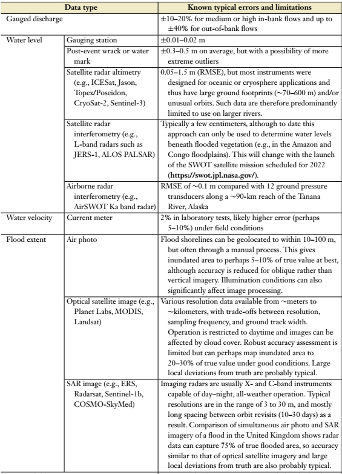

Operational issues and appendixes
=================================

In this section a few operational or more practical issues, like tables, "how-to" hints or frequently asked questions, software tricks or demos are explained in a more detailed way.

Hazard and Risk mapping
-----------------------
Directly associated to flood simulations, or frequently the promoter, is the calculation of the Flood Risk,
nowadays strongly linked to Climate-Change scenarios.

The Risk is a function of Hazard, Exposure, and Vulnerability, being:

#. Hazard, with two components:

   * Intensity: direct result of simulations that output rasters with Water Depth, Velocities, and Extents.

   * Probability of hazard: linked to the Return Period of the forcing boundary: a river discharge for fluvial floods, a rainfall for pluvial floods, or the sea level for coastal floods.
   
#. Exposure: related to accounting Land Uses, type of buildings and infrastructures, all analysed within a GIS Framework. Nowadays a correct and affordable pixel resolution for Risk calculations is as fine as 1-2 meters.

#. Vulnerability: through the damage curve that relates usually Water Depth versus Damage having particular dependencies on the physical structures or terrain contents, if the loss is direct or indirect, tangible (economic loss) or intangible (population, injuries or loss of life).

Tipically a Total-Damage is calculated as a sum over Polygons, considering an averaged Water-Depth(WD) over each surface Polygon (S):

.. math::

  TD=\sum_{Polygs} S_{Polyg} V_{Max-Dmg} \Theta_{Polyg}(\overline{WD})

A more complex analysis can be held by using the product of Depth times Velocity, 
specially when it is directly applied to population or cars, using the so called vulnerability curves.

Annual Expected Damage:
^^^^^^^^^^^^^^^^^^^^^^^
The expected annual damage (EAD), also known as averaged annual damage (AAD), 
although the former is more used to predict, is the average of flood damages calculated over a number of events, where 
the total damage for each event is weighted by its probability in a year, that weight can be:

.. math::

  W_i=1.-exp \left(\frac{-1} {T_i}\right) \; or \; W_i=\frac{1} {T_i}-\frac{1} {T_{i+1}}

Tabulating validation data sources
----------------------------------
From `Bates, 2022`_, we can extract a table with the most common sources and ranges for model validation.

  
.. _Bates, 2022: https://doi.org/10.1146/annurev-fluid-030121-113138

Urban scenarios: street meshing
-------------------------------

Setting up a Convolutional Neural Network like U-Net
----------------------------------------------------

A CNN U-Net with Attention Gates can be set up in a few lines of code with the open source `PyTorch`_ libraries.

.. _Pytorch: https://pytorch.org/ 

The basic theory, states that a CNN is trained to minimize the difference between a forwarded input (time n, domain \Omega_1) 
and a reference (time n+T, domain \Omega_2), for a set of K pairs.

.. math::

  D=\sum_{K} \left(Fwd_{cnn}(Img_{K,\Omega_1}^{n}), Img_{K, \Omega_2}^{n+T}\right)  

The selected configuration applies at the Forward-Step four "convolutional+pooling" downsampling layers, and afterwards another four upsamplings (U-shape)
connecting with attention gates, layers of the same Width-Height.

This initial Set-Up might require a CNN with as much as 57 M parameters to optimize, for a mosaic of 100 training images, and run in a few minutes both for training and prediction with Graphical Processor Units (GPU).

