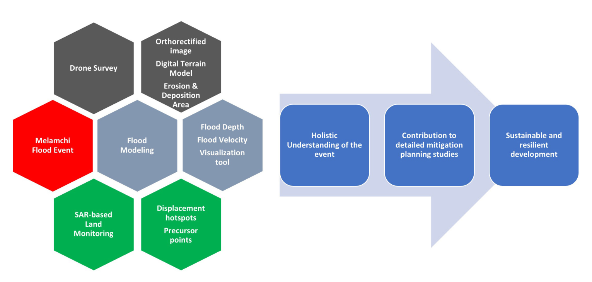

Post-flood disaster evaluation study
------------------------------------
As example to show how the discussed technologies are combined in order to evaluate and manage a post-flood scenario, a study case is analysed:
The Melamchi Flood Disaster in Nepal, June 2021, covering Damage and Risk Quantification with Drone Survey, Satellite-Based Land Displacement Analysis, and 2D Flood Modeling, from the original World-Bank report (not available yet).

  
  

