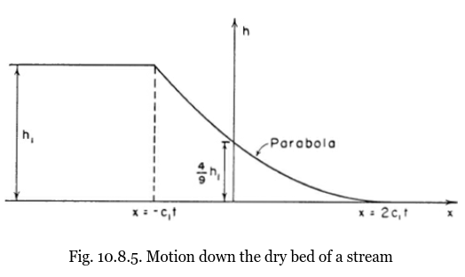

Wet-Dry front dynamics
======================

The Dam-Break problem or the breaking of a dam (Stoker, 1957, 1D) tracks the evolution of a reservoir and a downstream water column, both steady and with different heights initially, over ideal bottom conditions; flat and frictionless bed. Stoker showed there is an analytical or exact solution for the moving front: a simple "parabolic curve" when the downstream area is dry, and a more complex one when the downstream area is wet: [see figures]

Both problems are a good introduction to visualize the flooding dynamics of shallow water waves, although the complexity grows while natural conditions like irregular bottom (change of slopes) and friction or dissipation are considered. To solve "approximately"  the front evolution and flood extent we need to discretize the conservation of mass and momentum, and apply numerical algorithms crunched by computer power, once the bottom is known (think of a digital elevation model with a pixel resolution with horizontal and vertical accuracies) and the boundary conditions for the flows are measured or typified (think of inflow hydrographs, dikes, sinks, free flowing, etc.)

At this early point it is important to think if your study case will need to evaluate the whole dynamics, with fronts or discontinuities moving across the domain of interest, with an accurate speed distribution, or just mean water depth values and maximum flood extents that can be solved with simplified schemes that are not so CPU demanding or can be simply monitored by remote sensing devices over specific periods of time. In other words it is essential to determine the temporary scale of your water body transient states.

Dam-break advance over flat and dry bottom, the value of celerity is :math:`c_1=\sqrt{gh_1}`
